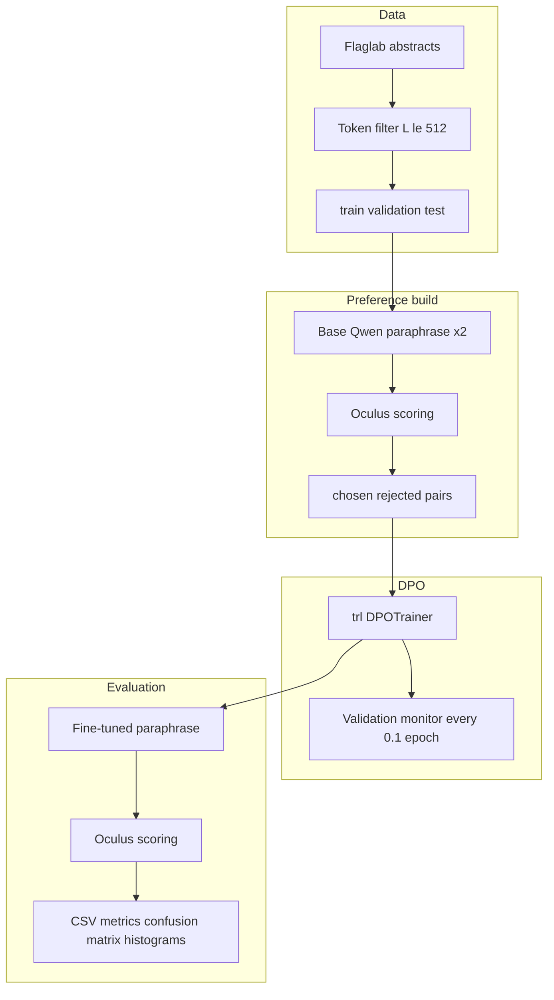

# ai-text-detector-tricking

DPO fine-tuning of [Qwen/Qwen2.5-0.5B-Instruct](https://huggingface.co/Qwen/Qwen2.5-0.5B-Instruct) on Spanish academic abstracts so that paraphrases receive lower AI-detection scores from [danibor/oculus-v2.0-multilingual](https://huggingface.co/danibor/oculus-v2.0-multilingual). The pipeline follows detector-guided preference construction from Nicks et al. Preference pairs are published at [pymlex/ai-generated-texts](https://huggingface.co/datasets/pymlex/ai-generated-texts). The resulting checkpoint is published at [pymlex/Qwen2.5-0.5B-Human](https://huggingface.co/pymlex/Qwen2.5-0.5B-Human).

## Overview

Source corpus: [Flaglab/academic-knowledge-abstracts-es](https://huggingface.co/datasets/Flaglab/academic-knowledge-abstracts-es), field `resumen`. After token-length filtering with the Qwen tokenizer at $L \le 512$, the retained split sizes are train $8891$, validation $1107$, test $1112$.

For each train abstract, the base instruct model samples two paraphrases at temperature $0.7$. Oculus scores each paraphrase with sigmoid probability $p \in [0,1]$ for the AI class. The lower-scoring paraphrase becomes `chosen`, the higher becomes `rejected`. Pairs with $|p_1 - p_2| < 0.05$ are discarded.

DPO maximises the margin between chosen and rejected completions relative to a frozen reference policy:

$$
\mathcal{L}_{\mathrm{DPO}}(\theta) = -\mathbb{E}\left[\log \sigma\left(\beta\left[\log \frac{\pi_\theta(y_w \mid x)}{\pi_{\mathrm{ref}}(y_w \mid x)} - \log \frac{\pi_\theta(y_l \mid x)}{\pi_{\mathrm{ref}}(y_l \mid x)}\right]\right)\right]
$$

with $\beta = 0.1$, learning rate $10^{-5}$, cosine schedule, warmup ratio $0.1$, bf16 on GPU, two epochs, effective batch size $32$.

Post-training evaluation generates one paraphrase per validation and test abstract with the fine-tuned model, scores each output with Oculus, and treats label $1$ as AI-generated. Metrics at threshold $0.5$: Accuracy, Precision, Recall, F1, MCC, ROC-AUC, mean logit.

## Architecture



## Project tree

```
ai-text-detector-tricking/
├── main.py
├── constants.py
├── requirements.txt
├── .env.example
├── schemas/
│   ├── detector.py
│   ├── preferences.py
│   └── evaluation.py
├── utils/
│   ├── config_loader.py
│   └── paths.py
├── data/
│   └── prepare.py
├── generation/
│   ├── prompts.py
│   └── paraphrase.py
├── detector/
│   ├── detector_arch.py
│   └── scoring.py
├── preferences/
│   └── build_dpo_dataset.py
├── training/
│   ├── dpo_train.py
│   └── callbacks.py
├── evaluation/
│   ├── metrics.py
│   └── evaluate.py
├── plotting/
│   └── figures.py
├── scripts/
│   ├── install_ubuntu_jupyter.sh
│   ├── run_all.sh
│   ├── setup_gh_auth.py
│   ├── push_dataset_hf.py
│   ├── push_model_hf.py
│   └── push_results_github.py
├── templates/
│   ├── dataset_card.md
│   └── model_card.md
└── results/
    ├── data/
    ├── preferences/
    ├── checkpoints/
    ├── monitoring/
    ├── metrics/
    └── plots/
```

## Detector

Oculus is a DeBERTa-v3-large encoder with mean pooling and a linear head to one logit. AI probability is $\sigma(z)$ with logit $z$. Implementation follows the official model card in `detector/detector_arch.py`.

## Ubuntu Jupyter workflow

Target hardware: NVIDIA RTX 5090, CUDA 13.0+, Ubuntu Jupyter.

### 1. Clone and install

```bash
git clone https://github.com/pymlex/ai-text-detector-tricking.git
cd ai-text-detector-tricking
bash scripts/install_ubuntu_jupyter.sh
cp .env.example .env
```

Set `HF_TOKEN` in `.env`. Optional: `GITHUB_NAME`, `GITHUB_EMAIL`, batch sizes, DPO hyperparameters.

### 2. Run pipeline steps

```bash
python main.py --step prepare
python main.py --step preferences
python main.py --step train
python main.py --step evaluate
python main.py --step plot
```

Or the full automated run with GitHub device login, Hugging Face uploads, and results push:

```bash
bash scripts/run_all.sh
```

### 3. Artefacts

| Path | Content |
| --- | --- |
| `results/data/filtered_abstracts` | Token-filtered splits |
| `results/plots/token_length_distribution.png` | Length histogram after filtering |
| `results/preferences/dpo_preferences.csv` | Full preference table with logits |
| `results/preferences/dpo_hf_dataset` | HF-ready DPO dataset |
| `results/checkpoints/` | DPO checkpoints every half epoch |
| `results/monitoring/monitor_step_*.json` | Validation detector scores during training |
| `results/plots/training_summary.png` | Monitoring summary |
| `results/metrics/final_*_scores.csv` | Per-text detector scores |
| `results/metrics/evaluation_report.json` | Aggregated metrics |
| `results/plots/detector_probability_hist_*.png` | Validation and test histograms |
| `results/plots/confusion_matrix_*.png` | Confusion matrices |

## Environment variables

| Variable | Default | Role |
| --- | --- | --- |
| `MODEL_ID` | `Qwen/Qwen2.5-0.5B-Instruct` | Base generator and DPO model |
| `DETECTOR_MODEL_ID` | `danibor/oculus-v2.0-multilingual` | AI detector |
| `DATASET_ID` | `Flaglab/academic-knowledge-abstracts-es` | Source abstracts |
| `MAX_TOKENS` | `512` | Filter and generation budget |
| `GENERATION_TEMPERATURE` | `0.7` | Paraphrase sampling temperature |
| `PREFERENCE_PROB_MARGIN` | `0.05` | Minimum probability gap for DPO pairs |
| `DPO_EPOCHS` | `2` | Training epochs |
| `DPO_PER_DEVICE_BATCH_SIZE` | `32` | Mini-batch size |
| `DPO_GRADIENT_ACCUMULATION_STEPS` | `1` | Gradient accumulation |
| `DPO_LEARNING_RATE` | `1e-5` | Adam learning rate |
| `DPO_BETA` | `0.1` | DPO temperature |
| `MONITORING_FRACTION` | `0.1` | Validation monitor interval in epochs |
| `CHECKPOINT_FRACTION` | `0.5` | Checkpoint interval in epochs |
| `HF_DATASET_REPO` | `pymlex/ai-generated-texts` | Preference dataset repo |
| `HF_MODEL_REPO` | `pymlex/Qwen2.5-0.5B-Human` | Fine-tuned model repo |

## Evaluation metrics

For generated paraphrases with true label $y=1$ and detector probability $\hat{p}$, threshold $t=0.5$, prediction $\hat{y} = \mathbb{1}[\hat{p} \ge t]$:

$$
\mathrm{Accuracy} = \frac{1}{N}\sum_{i=1}^{N}\mathbb{1}[\hat{y}_i = y_i]
$$

MCC uses the $2 \times 2$ confusion matrix over human versus AI predictions. ROC-AUC integrates TPR against FPR as the threshold sweeps over $\hat{p}$.

Lower mean detector probability and MCC near zero indicate successful evasion under the AI-positive labelling convention used in this benchmark.

## Citation

If you found this project useful, please cite it as:

```bibtex
@software{zyukov2026aitexttricking,
  author = {Zyukov, Alex},
  title = {ai-text-detector-tricking: DPO fine-tuning against multilingual AI text detectors},
  year = {2026},
  url = {https://github.com/pymlex/ai-text-detector-tricking},
  publisher = {GitHub},
  organization = {pymlex}
}
```

```bibtex
@article{nicks2024detectors,
  title = {Language Model Detectors Are Easily Optimized Against},
  author = {Nicks, Cameron and Chua, Jeremy and Liu, Stephen and others},
  year = {2024},
  eprint = {2406.07490},
  archivePrefix = {arXiv},
  primaryClass = {cs.CL},
  url = {https://arxiv.org/abs/2406.07490}
}
```

```bibtex
@misc{flaglab2025abstracts,
  title = {Academic Knowledge Abstracts Spanish},
  author = {Flaglab},
  year = {2025},
  url = {https://huggingface.co/datasets/Flaglab/academic-knowledge-abstracts-es}
}
```

```bibtex
@misc{oculus2026,
  title = {Oculus 2.0 Multilingual AI Text Detector},
  author = {danibor},
  year = {2026},
  url = {https://huggingface.co/danibor/oculus-v2.0-multilingual}
}
```

The project is under GPL-3.0 license.
