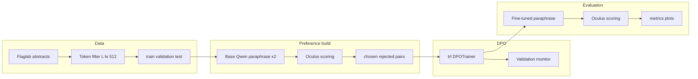
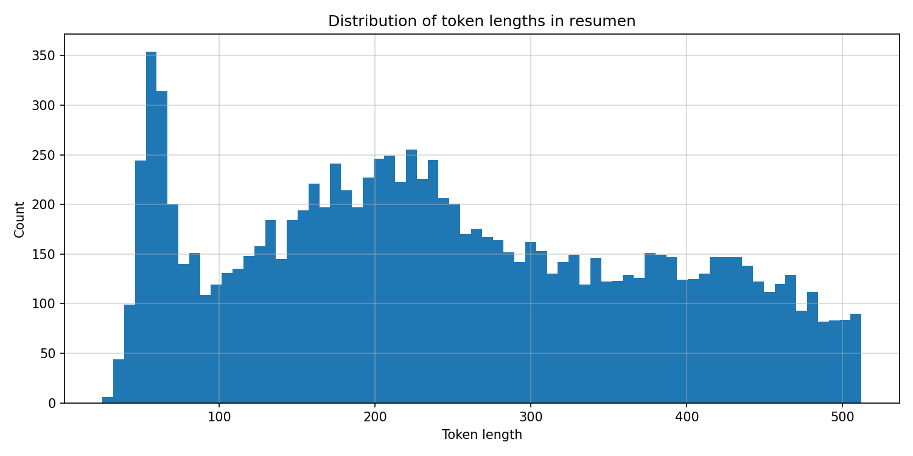
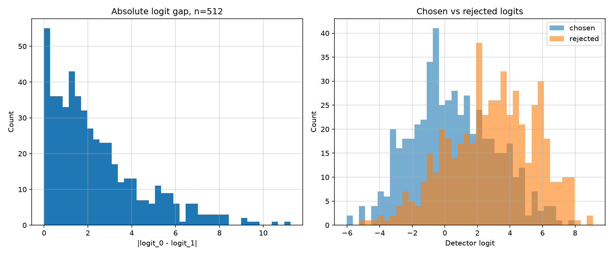
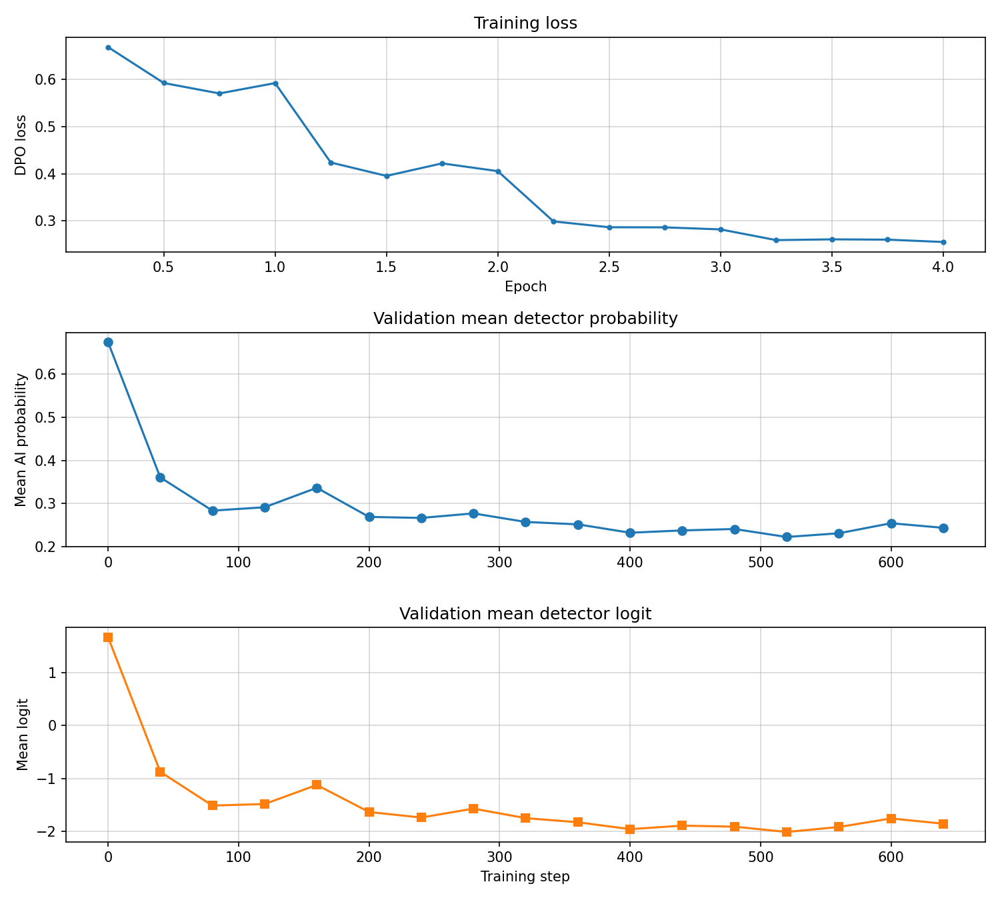
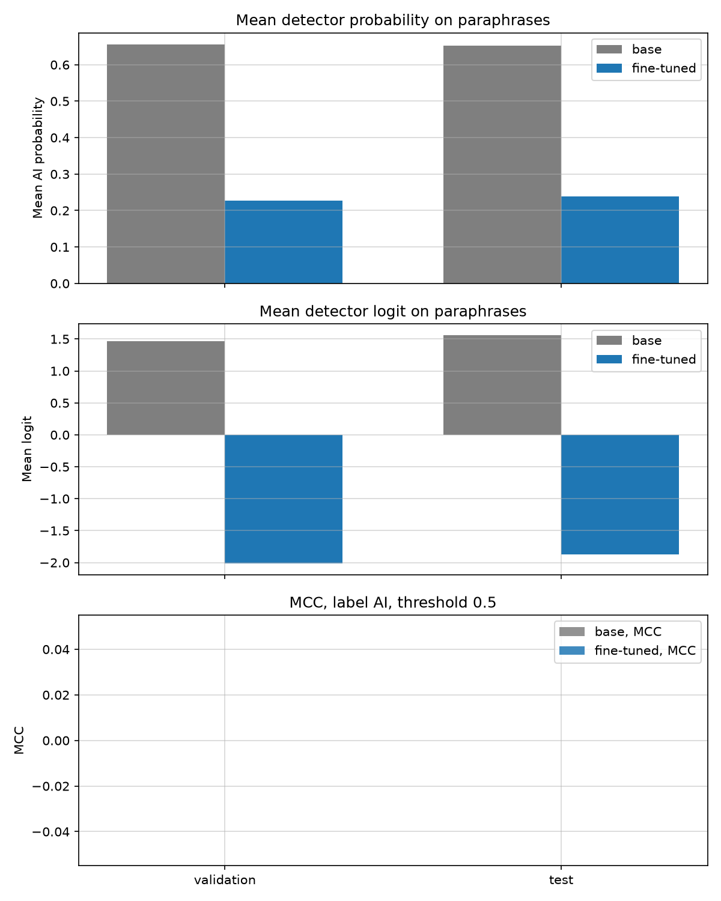
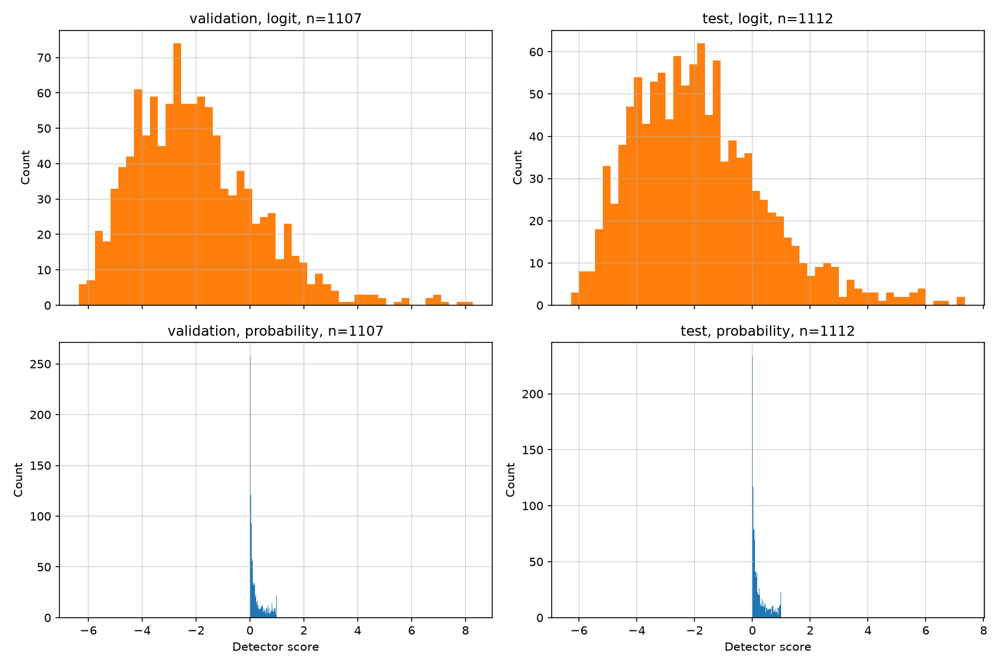
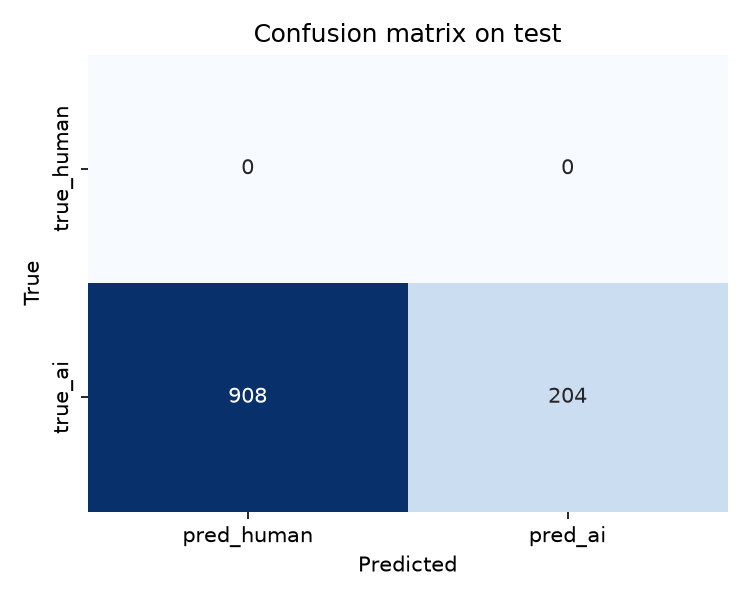

# DPO Fine-Tuning Against Multilingual AI Text Detectors

DPO fine-tuning of [Qwen/Qwen2.5-0.5B-Instruct](https://huggingface.co/Qwen/Qwen2.5-0.5B-Instruct) on Spanish academic abstracts so that paraphrases receive lower AI-detection scores from [danibor/oculus-v2.0-multilingual](https://huggingface.co/danibor/oculus-v2.0-multilingual). The pipeline follows detector-guided preference construction from Nicks et al. Preference pairs are published at [pymlex/ai-generated-texts](https://huggingface.co/datasets/pymlex/ai-generated-texts). The resulting checkpoint is published at [pymlex/Qwen2.5-0.5B-Human](https://huggingface.co/pymlex/Qwen2.5-0.5B-Human).

## Overview

Source corpus: [Flaglab/academic-knowledge-abstracts-es](https://huggingface.co/datasets/Flaglab/academic-knowledge-abstracts-es), field `resumen`. After token-length filtering with the Qwen tokenizer at $L \le 512$, the retained split sizes are train $8891$, validation $1107$, test $1112$.

For each train abstract, the base instruct model samples two paraphrases at temperature $0.7$. Oculus returns logit $z$ per paraphrase. The lower logit becomes `chosen`, the higher becomes `rejected`. Pairs with $|z_1 - z_2| < \tau$ are discarded, where $\tau$ is the logit margin threshold set in `.env`. Run the logit margin probe on 512 pairs to calibrate $\tau$ from the histogram.

DPO maximises the margin between chosen and rejected completions relative to a frozen reference policy:

$$
\mathcal{L}_{\mathrm{DPO}}(\theta) = -\mathbb{E}\left[\log \sigma\left(\beta\left[\log \frac{\pi_\theta(y_w \mid x)}{\pi_{\mathrm{ref}}(y_w \mid x)} - \log \frac{\pi_\theta(y_l \mid x)}{\pi_{\mathrm{ref}}(y_l \mid x)}\right]\right)\right]
$$

with $\beta = 0.1$, learning rate $10^{-5}$, cosine schedule, warmup ratio $0.1$, bf16 on GPU, four epochs, effective batch size $32$.

Post-training evaluation generates one paraphrase per validation and test abstract with the base and fine-tuned models, scores each output with Oculus, and treats label $1$ as AI-generated. Metrics at threshold $0.5$: Accuracy, Precision, Recall, F1, MCC, ROC-AUC, mean logit.

## Architecture



## Project tree

```
ai-text-detector-tricking/
├── main.py, constants.py, requirements.txt, .env.example
├── schemas/          detector, preferences, evaluation
├── utils/            config_loader, paths
├── data/             prepare
├── generation/       prompts, paraphrase
├── detector/         detector_arch, scoring
├── preferences/      build_dpo_dataset
├── training/         dpo_train, callbacks, history
├── evaluation/       metrics, evaluate
├── plotting/         figures, analysis_figures
├── analysis/         collect, narrative, cards, run_analysis
├── scripts/          install, run_all, publish_*, push_*
└── results/          data, preferences, checkpoints, monitoring, metrics, plots
```

## Detector

Oculus is a DeBERTa-v3-large encoder with mean pooling and a linear head to one logit. AI probability is $\sigma(z)$ with logit $z$. Implementation follows the official model card in `detector/detector_arch.py`.

## Ubuntu Jupyter workflow

Target hardware: NVIDIA RTX 5090, CUDA 13.0+, Ubuntu Jupyter.

### 1. Clone and install

```bash
git clone https://github.com/pymlex/ai-text-detector-tricking.git
cd ai-text-detector-tricking
bash scripts/install_ubuntu_jupyter.sh
cp .env.example .env
```

Set `HF_TOKEN` in `.env`. Optional: `GITHUB_NAME`, `GITHUB_EMAIL`, batch sizes, DPO hyperparameters.

### 2. Pipeline steps

#### Prepare

```bash
python main.py --step prepare
```

Downloads [Flaglab/academic-knowledge-abstracts-es](https://huggingface.co/datasets/Flaglab/academic-knowledge-abstracts-es), filters abstracts to $L \le 512$ tokens with the Qwen tokenizer, and saves train, validation, and test splits to `results/data/filtered_abstracts`. Writes the token-length histogram to `results/plots/token_length_distribution.png`.

#### Logit margin probe

```bash
python scripts/analyze_logit_margin.py
```

Generates two paraphrases per text for 512 train abstracts with the base model, scores them with Oculus, and builds histograms of $|z_1 - z_2|$. Output: `results/preferences/logit_margin_probe.csv`, `results/plots/logit_margin_probe_hist.png`, `results/plots/logit_chosen_rejected_hist.png`. Set the logit margin threshold in `.env` from the histogram before the next step.

#### Build preferences

```bash
python main.py --step preferences
```

For every train abstract, samples two paraphrases with the base Qwen model, ranks them by detector logit, and keeps pairs with $|z_1 - z_2| \ge \tau$. Saves `results/preferences/dpo_preferences.csv` and `results/preferences/dpo_hf_dataset`.

#### Train

```bash
python main.py --step train
```

Runs DPO for four epochs on the fixed preference dataset. Logs compact train metrics every 20 steps, evaluates the detector on a validation subset every 20 steps starting from step 0, saves checkpoints to `results/checkpoints/`, and writes train and validation history to `results/monitoring/`.

#### Evaluate

```bash
python main.py --step evaluate
```

Generates one paraphrase per validation and test abstract with the fine-tuned model, scores each output with Oculus, and writes per-text CSV files, aggregated metrics, confusion matrices, and histograms to `results/metrics/` and `results/plots/`.

#### Analyze

```bash
python main.py --step analyze
```

Collects all saved metrics, builds analysis plots in `results/plots/analysis/`, writes the narrative report `results/analysis/ANALYSIS.md`, and renders Hugging Face cards to `results/cards/`.

#### Publish

```bash
bash scripts/publish_all.sh
```

Runs analysis if needed, then pushes the DPO dataset with logit histograms to [pymlex/ai-generated-texts](https://huggingface.co/datasets/pymlex/ai-generated-texts), the fine-tuned weights and model card to [pymlex/Qwen2.5-0.5B-Human](https://huggingface.co/pymlex/Qwen2.5-0.5B-Human), and plots, metrics, predictions, and analysis to GitHub.

#### Full automated run

```bash
bash scripts/run_all.sh
```

GitHub device login, Hugging Face uploads, and results push in one script.

## Results

### Data preparation

After filtering at $L \le 512$ tokens: train $8891$, validation $1107$, test $1112$.



### Preference construction

From $8891$ train abstracts the pipeline retained $6396$ DPO pairs. $2495$ pairs were discarded because the logit gap $|z_1 - z_2|$ fell below the threshold $\tau = 1$. No empty paraphrase pairs were observed.

Logit margin probe on $512$ train pairs: mean $|z_1 - z_2| = 2.42$, median $1.80$, IQR $[0.87, 3.36]$, maximum gap $11.24$.



### Training

DPO ran for four epochs on $6396$ preference pairs. On a validation subset of $276$ texts, mean detector AI probability at step $0$ was $0.674$ and at the last monitor step $0.244$, a change of $-0.430$. Final logged DPO loss was $0.256$.



### Evaluation

One paraphrase per validation and test abstract was generated with the base instruct model and with the fine-tuned checkpoint. Oculus scored each output. Ground-truth label is AI-generated. Threshold on detector probability: $0.5$.

| Model | Split | n | mean prob | mean logit | accuracy | F1 |
| --- | --- | ---: | ---: | ---: | ---: | ---: | ---: | ---: |
| base | validation | 1107 | 0.6550 | 1.4619 | 0.6712 | 0.8032 |
| base | test | 1112 | 0.6532 | 1.5581 | 0.6655 | 0.7991 |
| fine-tuned | validation | 1107 | 0.2264 | -2.0100 | 0.1716 | 0.2930 |
| fine-tuned | test | 1112 | 0.2391 | -1.8733 | 0.1835 | 0.3100 |

On the test split the fine-tuned model lowered mean AI probability from $0.653$ to $0.239$ and mean logit from $1.558$ to $-1.873$ relative to the base model. Under the AI-positive labelling convention, accuracy and F1 drop because fewer paraphrases exceed the $0.5$ threshold. MCC remains zero and ROC-AUC is undefined because all ground-truth labels are AI-generated.








## Evaluation metrics

For generated paraphrases with true label $y=1$ and detector probability $\hat{p}$, threshold $t=0.5$, prediction $\hat{y} = \mathbb{1}[\hat{p} \ge t]$:

$$
\mathrm{Accuracy} = \frac{1}{N}\sum_{i=1}^{N}\mathbb{1}[\hat{y}_i = y_i]
$$

MCC uses the $2 \times 2$ confusion matrix over human versus AI predictions. ROC-AUC integrates TPR against FPR as the threshold sweeps over $\hat{p}$.

Lower mean detector probability and MCC near zero indicate successful evasion under the AI-positive labelling convention used in this benchmark.

## Citation

If you found this project useful, please cite it as:

```bibtex
@misc{zyukov2026aitexttricking,
  title         = {{DPO Fine-Tuning Against Multilingual AI Text Detectors}},
  author        = {Zyukov, Alex},
  year          = {2026},
  url           = {https://github.com/pymlex/ai-text-detector-tricking},
  publisher     = {GitHub},
  organization  = {pymlex}
}
```

The project is under GPL-3.0 license.

## References

```bibtex
@misc{nicks2024detectors,
  title         = {{Language Model Detectors Are Easily Optimized Against}},
  author        = {Nicks, Cameron and Chua, Jeremy and Liu, Stephen and others},
  year          = {2024},
  eprint        = {2406.07490},
  archivePrefix = {arXiv},
  primaryClass  = {cs.CL},
  url           = {https://arxiv.org/abs/2406.07490}
}
```

```bibtex
@misc{flaglab2025abstracts,
  title         = {{Academic Knowledge Abstracts Spanish}},
  author        = {Flaglab},
  year          = {2025},
  url           = {https://huggingface.co/datasets/Flaglab/academic-knowledge-abstracts-es}
}
```

```bibtex
@misc{oculus2026,
  title         = {{Oculus 2.0 Multilingual AI Text Detector}},
  author        = {danibor},
  year          = {2026},
  url           = {https://huggingface.co/danibor/oculus-v2.0-multilingual}
}
```
